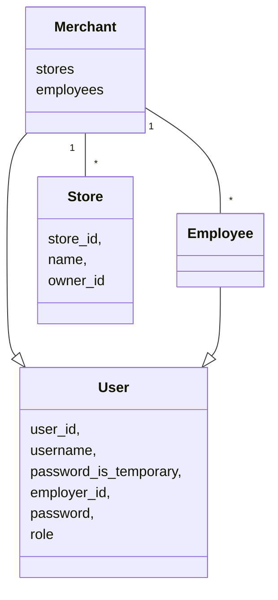

# Arkkitehtuuri

## Luokkakaavio

```mermaid
classDiagram
  class User {
    user_id,
    username,
    password_is_temporary,
    employer_id,
    password,
    role
  }
  class Merchant {
    stores
    employees  
  }
  class Employee {
    
  }
  class Store {
    store_id,
    name,
    owner_id
  }
  Merchant --|> User
  Employee --|> User
  Merchant "1" -- "*" Store
  Merchant "1" -- "*" Employee
```