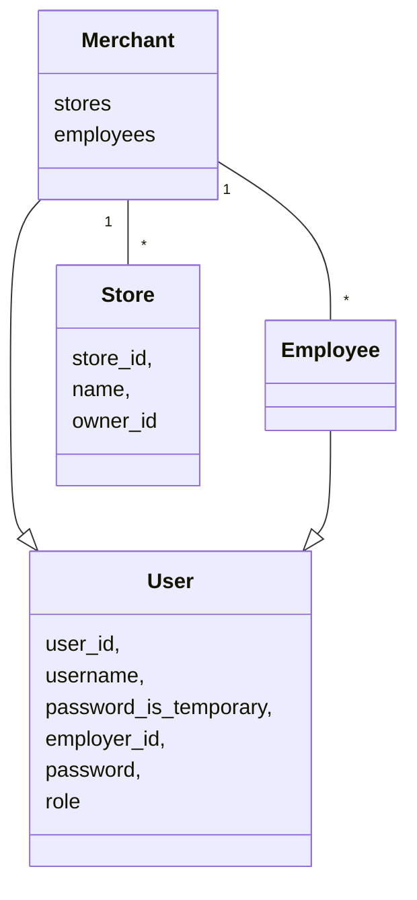
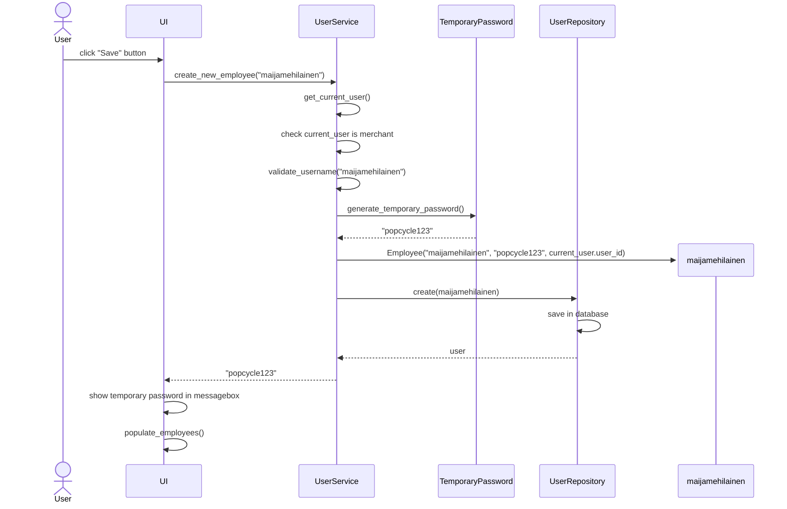

# Arkkitehtuuri

## Luokkakaavio

```mermaid
classDiagram
  class User {
    user_id,
    username,
    password_is_temporary,
    employer_id,
    password,
    role
  }
  class Merchant {
    stores
    employees  
  }
  class Employee {
    
  }
  class Store {
    store_id,
    name,
    owner_id
  }
  Merchant --|> User
  Employee --|> User
  Merchant "1" -- "*" Store
  Merchant "1" -- "*" Employee
```

## Sekvenssikaavio

### Työntekijän luominen Employees näkymässä

```mermaid
sequenceDiagram
  actor User
  participant UI
  participant UserService
  participant TemporaryPassword
  participant UserRepository
  User->>UI: click "Save" button
  UI->>UserService: create_new_employee("maijamehilainen")
  UserService->>UserService: get_current_user()
  UserService->>UserService: check current_user is merchant
  UserService->>UserService: validate_username("maijamehilainen")
  UserService->>TemporaryPassword: generate_temporary_password()
  TemporaryPassword-->>UserService: "popcycle123"
  create participant maijamehilainen
  UserService->>maijamehilainen: Employee("maijamehilainen", "popcycle123", current_user.user_id)
  UserService->>UserRepository: create(maijamehilainen)
  UserRepository->>UserRepository: save in database
  UserRepository-->>UserService: user
  UserService-->>UI: "popcycle123"
  UI->>UI: show temporary password in messagebox
  UI->>UI: populate_employees()
```