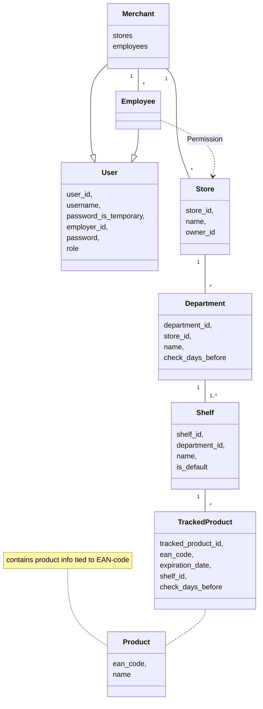
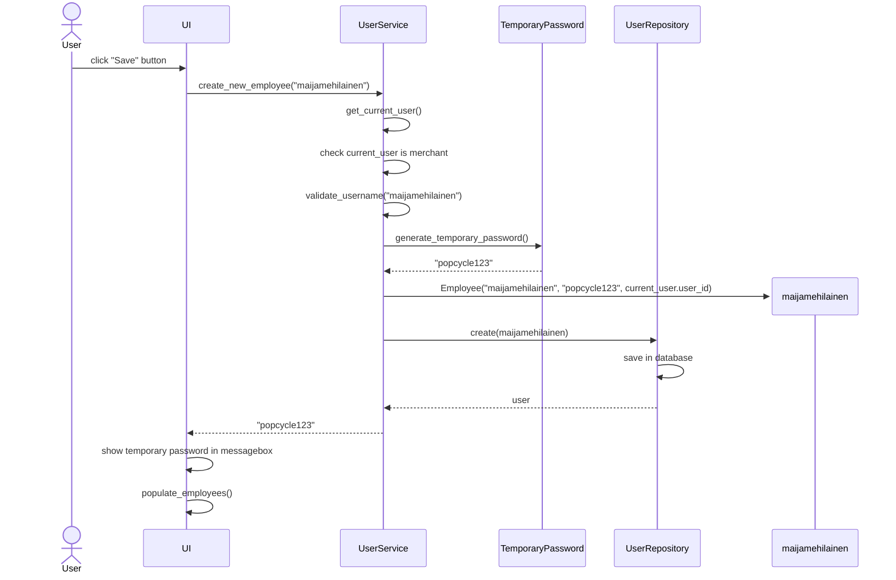
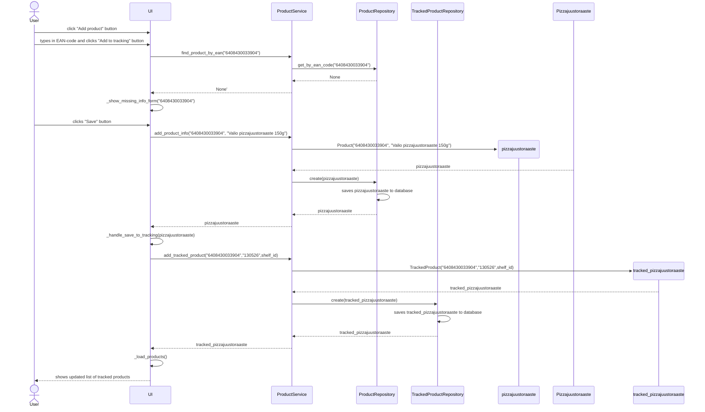

# Arkkitehtuurikuvaus

## Rakenne

Sovelluksen rakenne noudattaa kerrosarkkitehtuuria.

Pakkaus _entities_ sisältää luokat, jotka kuvaavat sovelluksen käyttämiä olioita.  
Pakkaus _repositories_ sisältää koodin, joka vastaa tietokantaoperaatioista.  
Pakkaus _services_ sisältää koodin, joka vastaa käyttöliittymän ja repositorioiden välisestä sovelluslogiikasta.  
Pakkaus _ui_ sisältää käyttöliittymään liittyvän koodin.  

## Käyttöliittymä

Käyttöliittymässä on _ui.py_, joka vastaa siitä, mikä näkymä käyttäjälle näytetään. Näkymiä ovat:
  - Sisäänkirjautumisnäkymä
  - Kauppiaan rekisteröintinäkymä
  - Koti-näkymä
  - Salasanan vaihtonäkymä
  - Työntekijöiden listaus ja hallintointinäkymä
  - Työntekijän käyttöoikeuksien hallinnointinäkymä
  - Kauppanäkymä, jossa osastojen listaus ja hallinnointi
  - Osastonäkymä, jossa hyllyjen listaus ja hallinnointi, sekä listaus tarkistettavista tuotteista ja merkitä uuden parasta ennen -päiväyksen
  - Hyllynäkymä, jossa voi hallinnoida seurannassa olevia tuotteita ja niiden parasta ennen -päiväyksiä

Jokaisella näkymällä on oma luokka, joka vastaa näkymästä ja käyttöliitymän koodi on eriytetty muusta sovelluslogiikasta. Käyttöliittymä kutsuu _service_-luokkien metodeja.

## Sovelluslogiikka

Sovelluksesta löytyvät olio-luokat:
  - User
  - Merchant
  - Employee
  - Store
  - Permission
  - Department
  - Shelf
  - Product
  - TrackedProduct

_Merchant_ ja _Employee_ ovat _User_-luokat periviä olioita, jotka määrittävät millaisia käyttöoikeuksia kyseisillä käyttäjillä voi olla sovelluksessa. _Permission_-luokka määrittelee tarkemmin _Employee_-olioiden käyttöoikeuksien tason. 

_Store_-luokka kuvaa kauppaa, jonka osastoja kuvaa _Department_-luokka, joilla on tarkistussääntö, kuinka monta päivää etukäteen parasta ennen -päiväyksiä tarkistetaan. _Shelf_-luokka, on osaston hyllyjä kuvaava luokka helpottamaan tuotteiden paikantamista osaston sisällä.

_Product_-luokka kuvaa tuotetta, jolla on EAN-koodi ja nimi. _TrackedProduct_-luokka kuvaa seurannassa olevaa tuotetta, sillä samaa tuotetta voi olla useilla eri hyllyillä/osastoilla ja eri parasta ennen -päiväyksillä.

### Luokkakaavio

## Tietojen pysyväistallennus

Sovellus käyttää SQLite-tietokantaa, joka tallentaa sovelluksen tarvitseman data käyttäjän omalle koneelle. Pakkauksen _repositories_ luokat vastaavat tietokantaan tallennuksesta ja muista tietokantaoperaatioista. Pakkauksen _service_ luokat kutsuvat _repositories_ pakkauksen luokkia ja käyttöliittymä on eryitetty niistä niin, että kommunikointi repositorioiden ja käyttöliittymän välillä tapahtuu vain _service_ luokkien kautta.

Sovellus tallentaa tiedot SQLite-tietokantataululuihin:
  - users
  - stores
  - employee_store_permissions
  - departments
  - shelves
  - products
  - tracked_products

## Päätoiminnallisuudet

### Kauppiaan rekisteröinti

Kauppias voi rekisteröityä sovellukseen syötämällä käyttäjätunnuksen (uniikki) ja salasanan. Sovellus pyytää myös vahvistamaan salasanan ja sen tulee täsmätä. 

### Käyttäjän sisäänkirjautuminen

Käyttäjä voi kirjautua sisään syöttämällä käyttäjänimensä ja salasanansa niille varattuihin syötekenttiin.

### Työntekijän luominen Employees näkymässä

Kauppias voi luoda uusia työntekijäroolin omaavia käyttäjiä. Työntekijän luominen etenee seuraavasti:

Käyttäjä syöttää työntekijälle _käyttäjänimen_ ja painaa "Save"-painiketta. UI:n tapahtumankäsittelijä kutsuu `UserService`-luokan sovelluslogiikkaa, joka vastaa uuden työntekijän luonnista. `UserService` validoi syötteen ja luo uuden _kertakäyttösalasanan_. Tämän jälkeen `UserService` pyytää `UserRepository`-luokkaa tallentamaan uuden käyttäjän tietokantaan. `UserService` palauttaa UI:lle _kertakäyttösalasanan_ ja UI näyttää salasanan käyttäjälle ilmoitusikkunassa. UI kutsuu omaa tapahtumankäsittelijäänsä, joka lataa uuden päivitetyn listan työntekijöistä, joka näytetään käyttäjälle.

### Kaupan luominen

Kauppias voi luoda kauppoja. Työtekijät näkymässä kauppias voi antaa yksittäisille työntekijöille käyttöoikeuksia kauppaan: katseluoikeus, muokkausoikeus ja hallinnointioikeus.

Katseluoikeudella voi tarkastella parasta ennen -päiväyksiä ja merkitä niitä. Muokkasoikeudella voi lisätä ja poistaa tuotteita hyllyistä. Hallinnointioikeudella voi muokata kaupan osasto- ja hyllyrakennetta.

### Osaston luominen

Kaupan näkymän kautta voi luoda uuden osaston. Osastolle luodaan oletusarvoisesti yksi hylly. Sen nimeä voi muokata.

### Hyllyn luominen

Osaston näkymässä voi luoda osastolle uusia hyllyjä ja muokata niiden nimiä.

### Tuotteen lisääminen seurantaan

Hyllyn näkymässä voi lisätä tuotteita seurantaan niiden _parasta ennen-päiväyksen_ perusteella. Tuotteen lisäämisen yhteydessä sovellus pyytää lisäämään tuotteen tiedot (nimen), jos tuotetta ei löydy tietokannasta. Tässä tapauksessa tuotteen lisääminen etenee hyllyn näkymästä seuraavasti:

Käyttäjä painaa "Add product"-painiketta. UI avaa syötekentän _EAN-koodia_ varten. Käyttäjä syöttää _EAN-koodin_ ja painaa "Add to tracking"-painiketta. UI:n tapahtumankäsittelijä kutsuu `ProductService`-luokan sovelluslogiikkametodia, joka tarkistaa löytyykö tuotteen tiedot tietokannasta `ProductRepository`-luokan kautta. Koska ei löydy palautetaan _None_. UI näyttää käyttäjälle _missing info_-lomakkeen ja käyttäjä syöttää tuotteelle _nimen_ sekä _parasta ennen-päiväyksen_. UI:n tapahtumankäsittelijä kutsuu jälleen `ProducService`sovelluslogiikkaa, joka vastaa tuotteen tietojen ja tuotteen seurantaan lisäämisestä. `ProductService` kutsuu `ProductRepository`ja `TrackedProductRepository`-luokkia, jotka vastaavat tiedon pysyväistallennuksesta tietokantaan. UI kutsuu omaa tapahtumankäsittelijäänsä, joka lataa käyttäjälle näytettävän päivitetyn listan seurannassa olevista tuotteista.

## Ohjelman rakenteeseen jääneet heikkoudet

Tällä hetkellä kaikki haut tapahtuvat tietokannan välityksellä ja haut saattavat olla raskaita ja toisinaan hitaita, varsinkin kun datan määrä kasvaa ja seurannassa olevien tuotteiden määrä kasvaa voi optimointi olla paikallaan.
