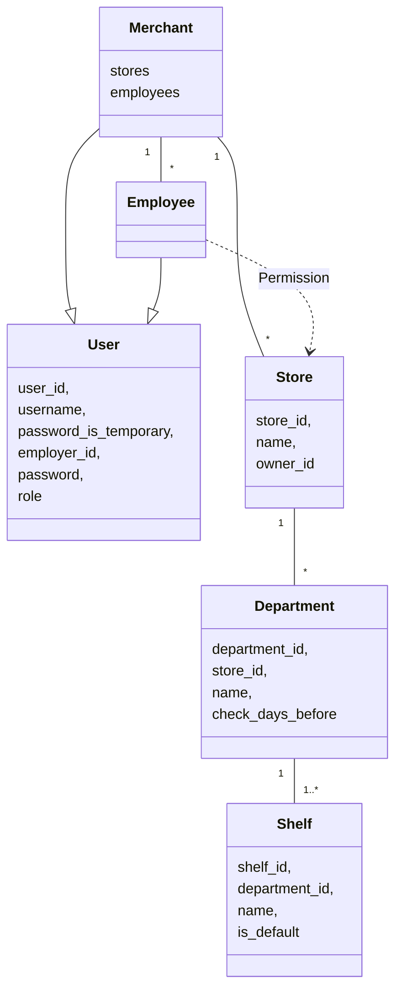
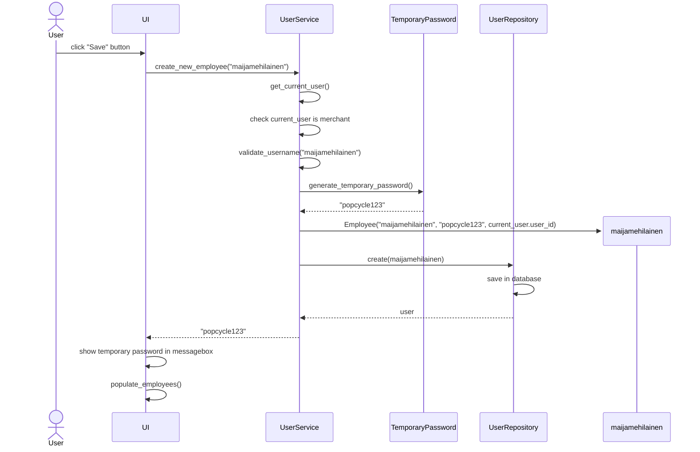

# Arkkitehtuurikuvaus

## Rakenne

Sovelluksen rakenne noudattaa kerrosarkkitehtuuria.

Pakkaus _entities_ sisältää luokat, jotka kuvaavat sovelluksen käyttämiä olioita.  
Pakkaus _repositories_ sisältää koodin, joka vastaa tietokantaoperaatioista.  
Pakkaus _services_ sisältää koodin, joka vastaa käyttöliittymän ja repositorioiden välisestä sovelluslogiikasta.  
Pakkaus _ui_ sisältää käyttöliittymään liittyvän koodin.  

## Käyttöliittymä

Käyttöliittymässä on _ui.py_, joka vastaa siitä, mikä näkymä käyttäjälle näytetään. Näkymiä ovat:
  - Sisäänkirjautumisnäkymä
  - Kauppiaan rekisteröintinäkymä
  - Koti-näkymä
  - Salasanan vaihtonäkymä
  - Työntekijöiden listaus ja hallintointinäkymä
  - Työntekijän käyttöoikeuksien hallinnointinäkymä
  - Kauppanäkymä, jossa osastojen listaus ja hallinnointi
  - Osastonäkymä, jossa hyllyjen listaus ja hallinnointi

Jokaisella näkymällä on oma luokka, joka vastaa näkymästä ja käyttöliitymän koodi on eriyitetty muusta sovelluslogiikasta. Käyttöliittymä kutsuu _service_-luokkien metodeja.

## Sovelluslogiikka

Sovelluksesta löytyvät luokat:
  - User
  - Merchant
  - Employee
  - Store
  - Permission
  - Department
  - Shelf

_Merchant_ ja _Employee_ ovat _User_-luokat periviä olioita, jotka määrittävät millaisia käyttöoikeuksia kyseisillä käyttäjillä voi olla sovelluksessa. _Permission_-luokka määrittelee tarkemmin _Employee_-olioiden käyttöoikeuksien tason. 

_Store_-luokka kuvaa kauppaa, jonka osastoja kuvaa _Department_-luokka, joilla on tarkistussääntö, kuinka monta päivää etukäteen parasta ennen -päiväyksiä tarkistetaan. _Shelf_-luokka, on osaston hyllyjä kuvaava luokka helpottamaan tuotteiden paikantamista osaston sisällä.

### Luokkakaavio

## Tietojen pysyväistallennus

Sovellus käyttää SQLite-tietokantaa, joka tallentaa sovelluksen tarvitseman data käyttäjän omalle koneelle. Pakkauksen _repositories_ luokat vastaavat tietokantaan tallennuksesta ja muista tietokantaoperaatioista. Pakkauksen _service_ luokat kutsuvat _repositories_ pakkauksen luokkia ja käyttöliittymä on eryitetty niistä niin, että kommunikointi repositorioiden ja käyttöliittymän välillä tapahtuu vain _service_ luokkien kautta.

Sovellus tallentaa tiedot SQLite-tietokantataululuihin:
  - users
  - stores
  - employee_store_permissions
  - departments
  - shelves

## Päätoiminnallisuudet

### Kauppiaan rekisteröinti

Kauppias voi rekisteröityä sovellukseen syötämällä käyttäjätunnuksen (uniikki) ja salasanan. Sovellus pyytää myös vahvistamaan salasanan ja sen tulee täsmätä. 

### Käyttäjän sisäänkirjautuminen

Käyttäjä voi kirjautua sisään syöttämällä käyttäjänimensä ja salasanansa niille varattuihin syötekenttiin.

### Työntekijän luominen Employees näkymässä

Kauppias voi luoda uusia työntekijäroolin omaavia käyttäjiä. Työntekijän luominen etenee seuraavasti:

### Kaupan luominen

Kauppias voi luoda kauppoja. Työtekijät näkymässä kauppias voi antaa yksittäisille työntekijöille käyttöoikeuksia kauppaan: katseluoikeus, muokkausoikeus ja hallinnointioikeus.

Katseluoikeudella voi tarkastella parasta ennen -päiväyksiä ja merkitä niitä. Muokkasoikeudella voi lisätä ja poistaa tuotteita hyllyistä. Hallinnointioikeudella voi muokata kaupan osasto- ja hyllyrakennetta.

### Osaston luominen

Kaupan näkymän kautta voi luoda uuden osaston. Osastolle luodaan oletusarvoisesti yksi hylly. Sen nimeä voi muokata.

### Hyllyn luominen

Osaston näkymässä voi luoda osastolle uusia hyllyjä ja muokata niiden nimiä.

## Ohjelman rakenteeseen jääneet heikkoudet

Tällä hetkellä kaikki haut tapahtuvat tietokannan välityksellä ja haut saattavat olla raskaita ja toisinaan hitaita.
