# Käyttöohje

## Ohjelman käynnistäminen 

Ennen kuin ohjelman voi käynnistää tulee asentaa riippuvuudet sekä alustaa tietokanta.

Asenna riippuvuudet siirtymällä hakemistoon _expiration_date_tracking_app_ ja asenna riippuvuudet komentorivikomennolla:

```bash
poetry install
```

Tietokannan alustus tehdään komentorivikomennolla:

```bash
poetry run invoke build
```

Tämän jälkeen ohjelman saa käynnistettyä komentorivikomennolla:

```bash
poetry run invoke start
```

## Käyttäjätunnuksen luominen

### Kauppiaan käyttäjätunnuksen luominen

Sovellus käynnistyy kirjautumisnäkymään: 

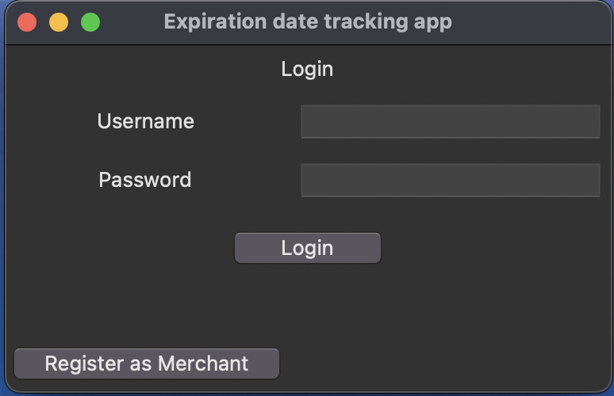

Siirry rekisteröitymisnäkymään painamalla _Register as merchant_-painiketta. Kauppiaan käyttäjätunnus luodaan kirjoittamalla syötekenttiin unikki käyttäjänimi ja salasana tulee syöttää kaksi kertaa täysin samassa muodossa. Tämän jälkeen tunnus luodaan _Register_-painikkeella. Jos tunnuksen luominen on onnistunut siirtyy sovellus kirjautumisnäkymään.

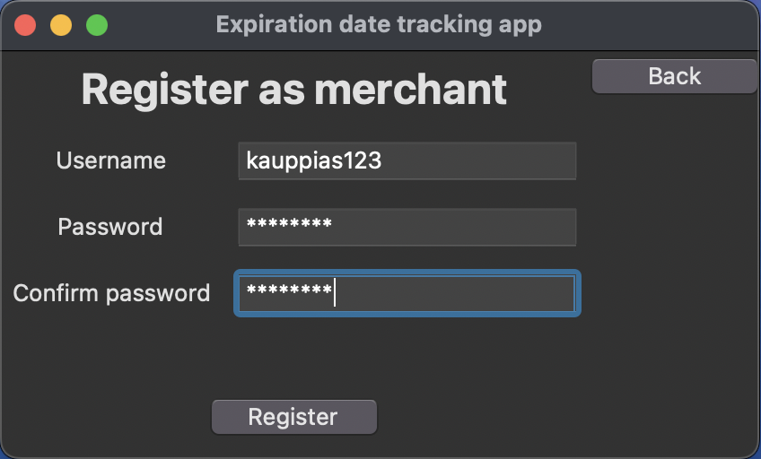

### Työntekijän käyttäjätunnuksen luominen

Vain rekisteröitynyt kauppias voi luoda työntekijälle käyttäjätunnuksen. Tunnus luodaan työntekijöiden hallinnointinäkymässä, jonne siirrytään kotinäkymästä painamalla _Employees_-painiketta:

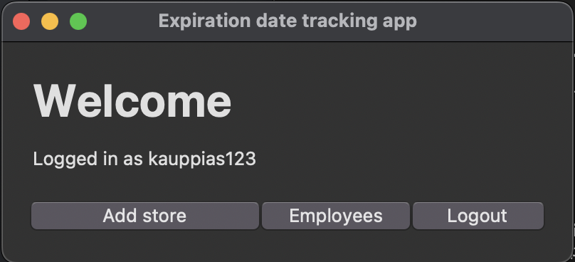

Tämän jälkeen painetaan _Add employee_-painiketta, joka avaa syötekentän. Syötä työntekijälle haluttu käyttäjänimi:

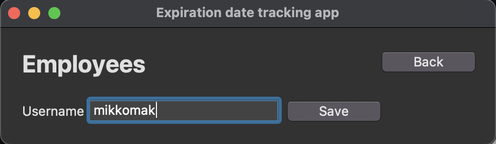

Tunnus luodaan painamalla _Save_-painiketta. Tämän jälkeen avautuu ilmoitusikkuna, jossa on kertakirjautumissalasana.

**HUOM!** Ota kertakirjautumissalasana ylös ennen kuin suljet ikkunan.

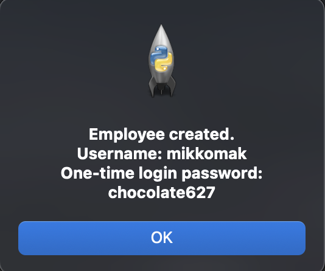

Anna luotu käyttäjätunnus ja kertakirjautumissalasana työntekijälle. Sovellus pyytää häntä vaihtamaan salasanan ensimmäisen kirjautumisen yhteydessä.

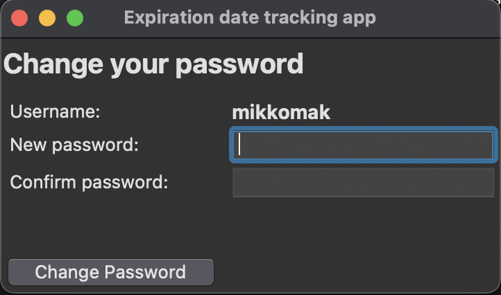

## Kirjautuminen

Sovellus käynnistyy kirjautumisnäkymään. Syötekenttiin kirjoitetaan käyttäjänimi ja salasana. Tämän jälkeen sovellus kirjautuu sisään _Login_-painiketta painamalla ja siirtyy kotinäkymään.

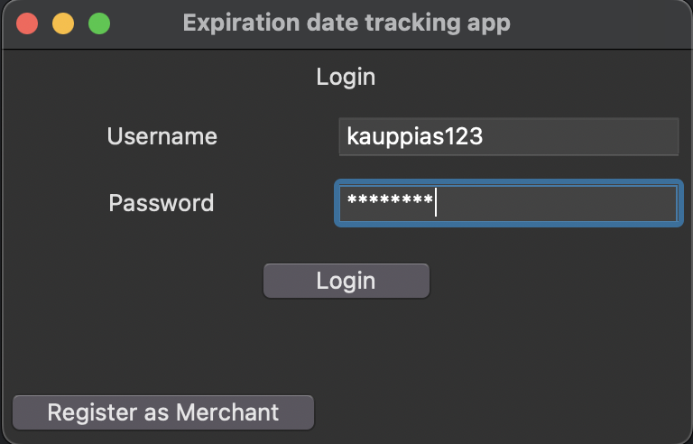

## Kaupan lisääminen

Kaupan saa lisättyä kotinäkymän _Add store_-painikkeella. Kirjoita syötekenttään kaupan nimi ja paina _Save_-painiketta.

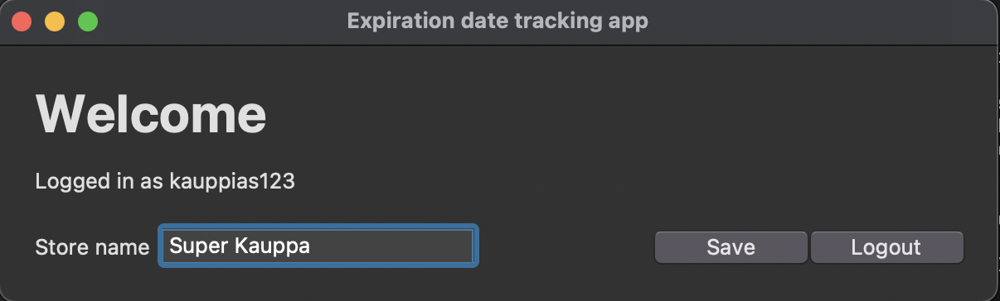

### Työntekijän käyttöoikeudet kauppaan

Työntekijälle voi lisätä käyttöoikeuden kauppaan työntekijöiden hallinnointinäkymässä. Paina sen työntekijän käyttäjänimeä, jonka oikeuden haluat määrittää. Sovellus avautuu työntekijän näkymään, jossa kauppakohtaiset käyttöoikeudet voi asettaa dropdown valikosta.

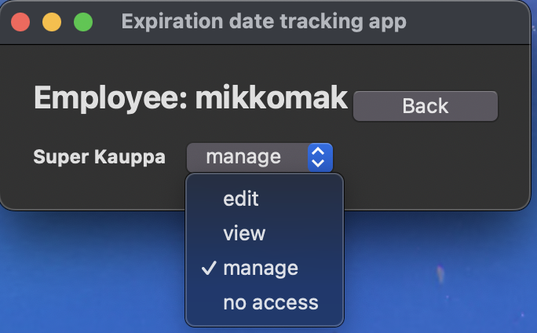

_Manage_-käyttöoikeuksilla työntekijä saa täydet oikeudet muokata kaupan osastoja, hyllyjä ja tuotteita.

## Osaston luominen

Siirry kotinäkymästä kaupan näkymään painamalla, sen kaupan nimeä, jota haluat muokata. Sovellus avaa kaupan näkymän. Kaupan saa lisättyä _Add department_-painikkeella. Syötä syötekenttiin osaston nimi ja kuinka monta päivää ennen kyseisen osaston tuotteet tarkistetaan. Osasto luodaan _Save_-painikkeella.

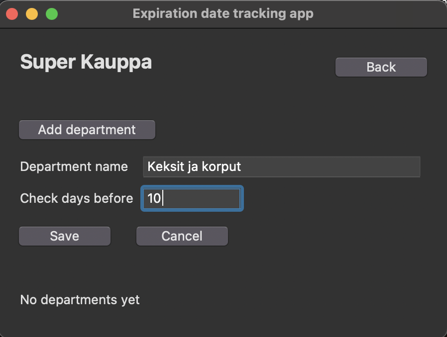

Osaston näkymään pääsee siirtymään painamalla osaston nimeä. Osastolle luodaan automaattisesti yksi oletushylly. Hyllyjä voi lisätä _Add shelf_-painikkeella ja nimeä muokata painamalla halutun hyllyn nimeä.

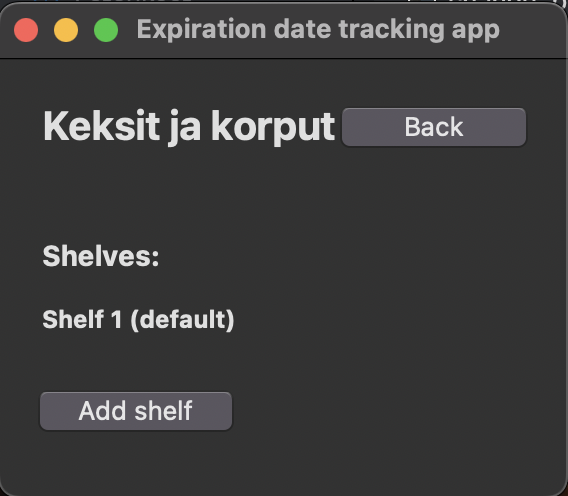

