# Käyttöohje

## Ohjelman käynnistäminen 

Ennen kuin ohjelman voi käynnistää tulee asentaa riippuvuudet sekä alustaa tietokanta.

Asenna riippuvuudet siirtymällä hakemistoon _expiration_date_tracking_app_ ja asenna riippuvuudet komentorivikomennolla:

```bash
poetry install
```

Tietokannan alustus tehdään komentorivikomennolla:

```bash
poetry run invoke build
```

Mikäli haluat konfiguroida tietokantatiedoston nimen voit tehdä sen _.env_-tiedostoon ennen build-komennon suorittamista.

Tämän jälkeen ohjelman saa käynnistettyä komentorivikomennolla:

```bash
poetry run invoke start
```

## Käyttäjätunnuksen luominen

### Kauppiaan käyttäjätunnuksen luominen

Sovellus käynnistyy kirjautumisnäkymään: 


Siirry rekisteröitymisnäkymään painamalla vasemman alakulman _"Register as merchant"_-painiketta. Kauppiaan käyttäjätunnus luodaan kirjoittamalla syötekenttiin unikki käyttäjänimi ja salasana tulee syöttää kaksi kertaa täysin samassa muodossa. Tämän jälkeen tunnus luodaan _"Register"_-painikkeella. Jos tunnuksen luominen on onnistunut siirtyy sovellus kirjautumisnäkymään.


### Työntekijän käyttäjätunnuksen luominen

Vain rekisteröitynyt kauppias voi luoda työntekijälle käyttäjätunnuksen. Tunnus luodaan työntekijöiden hallinnointinäkymässä, jonne siirrytään kotinäkymästä painamalla alareunassa sijaitsevaa _"Employees"_-painiketta:


Tämän jälkeen painetaan _"Add employee"_-painiketta, joka avaa syötekentän. Syötä työntekijälle haluttu käyttäjänimi:


Tunnus luodaan painamalla _"Save"_-painiketta. Tämän jälkeen avautuu ilmoitusikkuna, jossa on kertakirjautumissalasana.

**HUOM!** Ota kertakirjautumissalasana ylös ennen kuin suljet ikkunan.


Anna luotu käyttäjätunnus ja kertakirjautumissalasana työntekijälle. Sovellus pyytää häntä vaihtamaan salasanan ensimmäisen kirjautumisen yhteydessä.


## Kirjautuminen

Sovellus käynnistyy kirjautumisnäkymään. Syötekenttiin kirjoitetaan käyttäjänimi ja salasana. Tämän jälkeen sovellus kirjautuu sisään _"Login"_-painiketta painamalla ja siirtyy kotinäkymään.


## Kaupan lisääminen

Kaupan saa lisättyä kotinäkymän _"Add store"_-painikkeella. Kirjoita syötekenttään kaupan nimi ja paina _"Save"_-painiketta.


### Työntekijän käyttöoikeudet kauppaan

Työntekijälle voi lisätä käyttöoikeuden kauppaan työntekijöiden hallinnointinäkymässä. Paina sen työntekijän käyttäjänimeä, jonka oikeuden haluat määrittää. Sovellus avautuu työntekijän näkymään, jossa kauppakohtaiset käyttöoikeudet voi asettaa dropdown valikosta.


_"Manage"_-käyttöoikeuksilla työntekijä saa täydet oikeudet muokata kaupan osastoja, hyllyjä ja tuotteita.  
_"Edit"_-käyttöoikeuksilla työntekijä voi lisätä ja poistaa tuotteita seurannasta ja hallinnoida päiväyksiä.  
_"View"_-käyttöoikeuksilla työntekijä voi hallinnoida päiväyksiä.  

## Osaston luominen

Siirry kotinäkymästä kaupan näkymään painamalla, sen kaupan nimeä, jota haluat muokata. Sovellus avaa kaupan näkymän. Kaupan saa lisättyä _"Add department"_-painikkeella. Syötä syötekenttiin osaston nimi ja kuinka monta päivää ennen kyseisen osaston tuotteet tarkistetaan. Osasto luodaan _"Save"_-painikkeella.

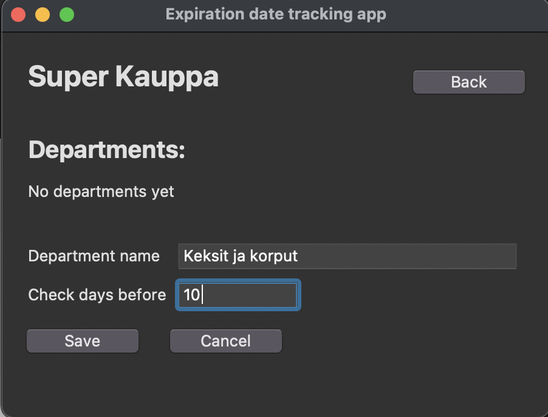

Osaston näkymään pääsee siirtymään painamalla osaston nimeä. Osastolle luodaan automaattisesti yksi oletushylly. Hyllyjä voi lisätä _"Add shelf"_-painikkeella ja nimeä muokata painamalla _"Edit"_-painiketta hyllyn nimen vieressä.


## Hyllyn luominen

Siirry osaston näkymään kaupan näkymästä painamalla, sen osaston nimeä, johon haluat lisätä hyllyjä. Paina _"Add shelf"_-painiketta. Syötä hyllylle nimi syötekenttään. Paina _"Save"_-painiketta

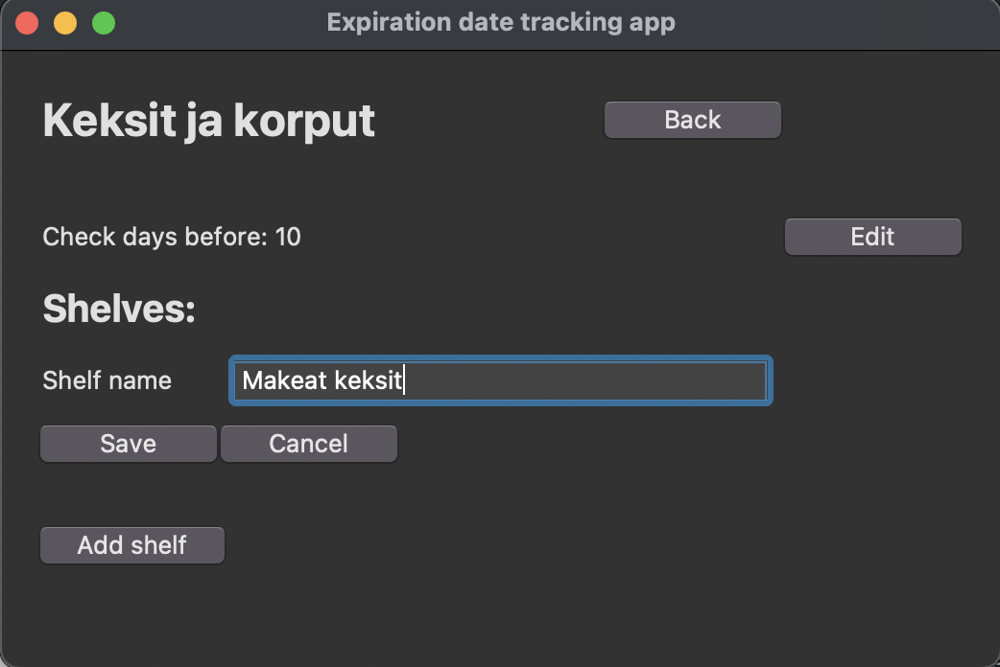

## Hyllyn nimen muokkaaminen

Paina _"Edit"_-painiketta hyllyn nimen vieressä. Syötä uusi nimi syötekenttään. Paina _"Save"_-painiketta.

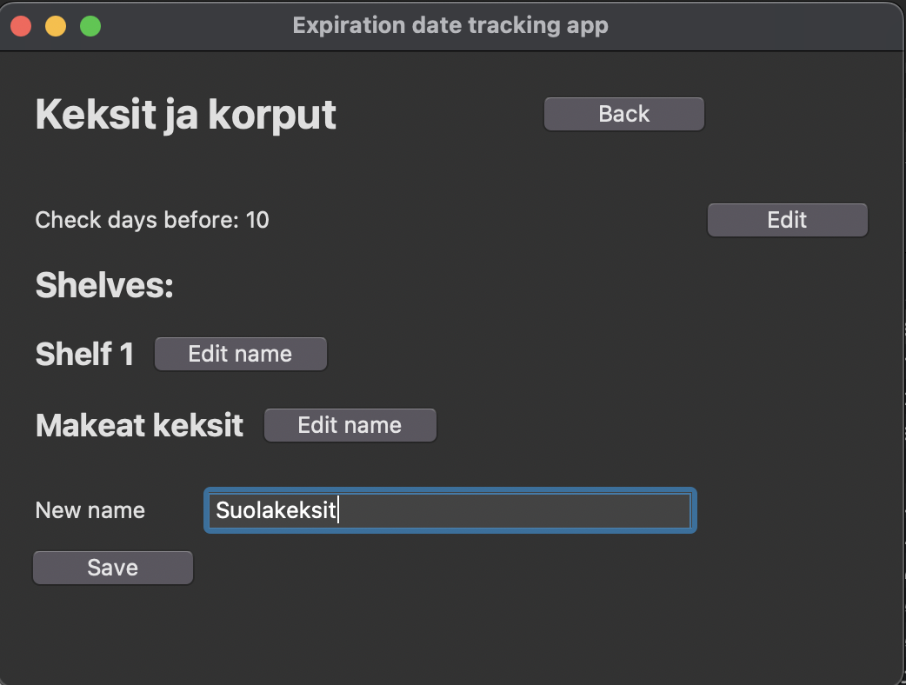

## Tuotteiden lisääminen seurantaan

Siirry hyllyn näkymään painamalla sen hyllyn nimeä, jolla tuote sijaitseen. Paina _"Add product"_-painiketta. Syöte tuotteen EAN-koodi syötekenttään ja paina "Add to tracking"-painiketta.

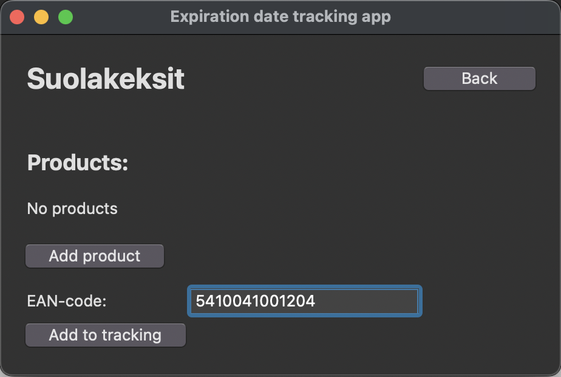

Tarkista tuotteen parasta ennen-päiväys tuotteen pakkauksesta ja syötä se syötekenttään muodossa `ppkkvv`. Paina _"Save"_-painiketta

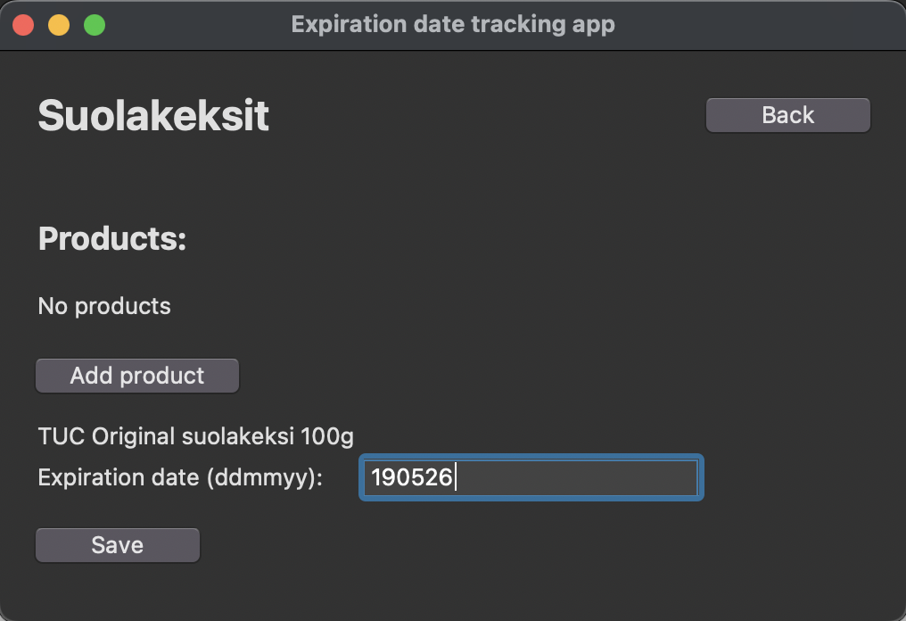

Tämän jälkeen listaus kaikista seurannassa olevista tuotteista löytyy hyllyn näkymästä

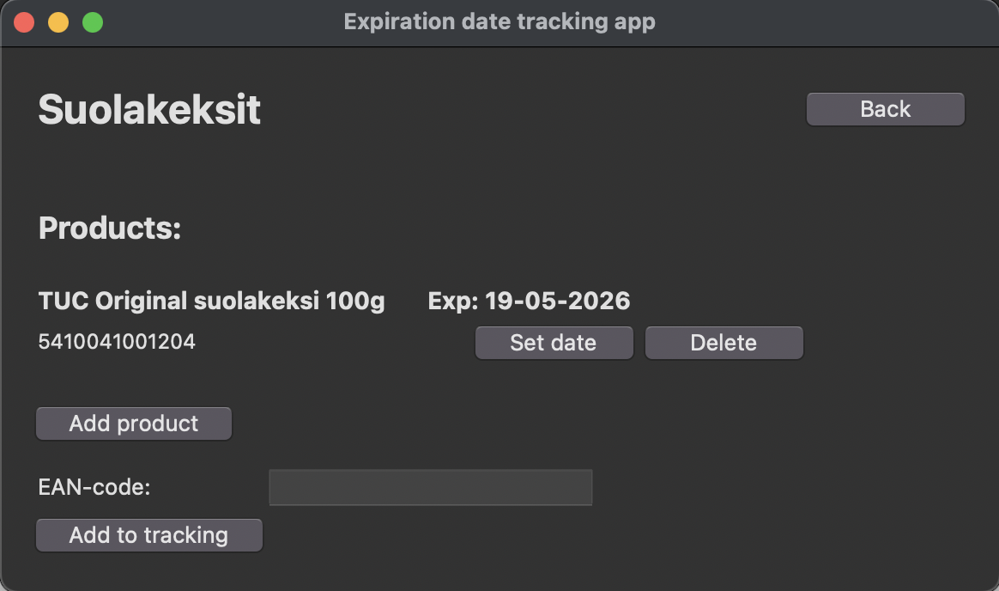

### Tuotteen tiedot puuttuvat

Jos tuotteen tiedot puuttuvat pyytää sovellus lisäämään ne.

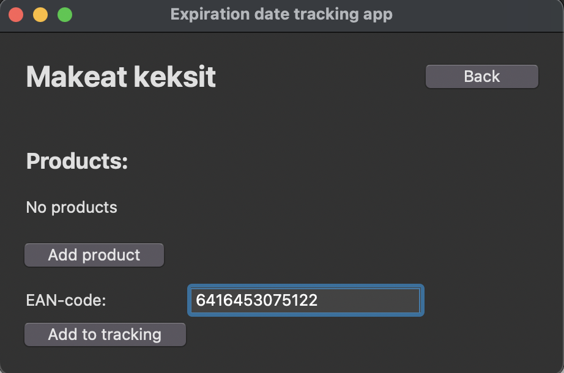

Syötä tuotteen nimi syötekenttään ja anna parasta ennen -päiväys muodossa `ppkkvv`. Paina _"Save"_-painiketta.

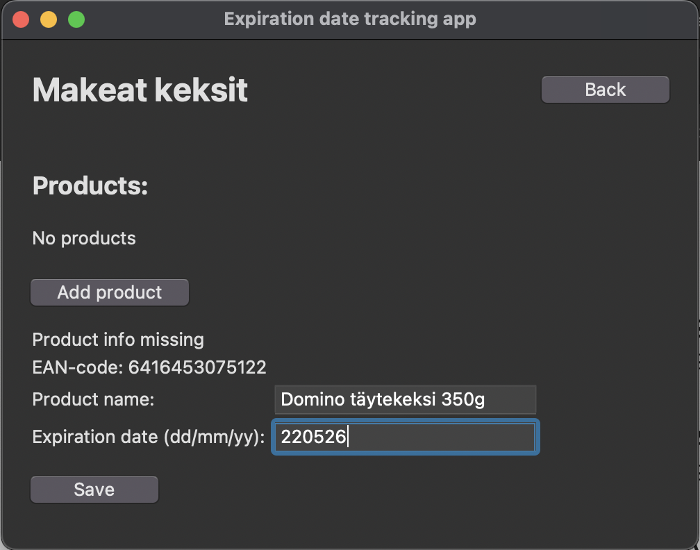

## Päiväysten tarkistaminen

Näet listauksen tarkistettavista tuotteista osastonäkymässä

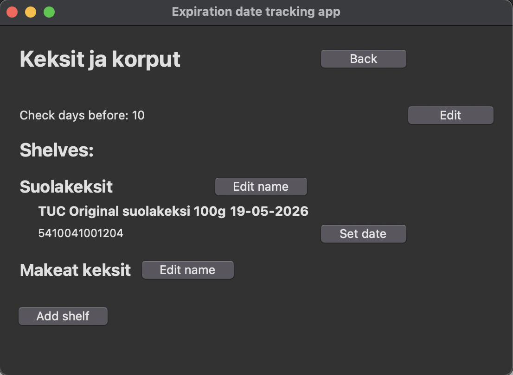

Paina tarkistettavan tuotteen _"Set date"_-painiketta. Tarkista uusi parasta ennen -päiväys kaupan hyllyssä olevasta tuotteesta. Kirjoita se syötekenttään muodossa `ppkkvv`. Paina _"Save"_-painiketta.

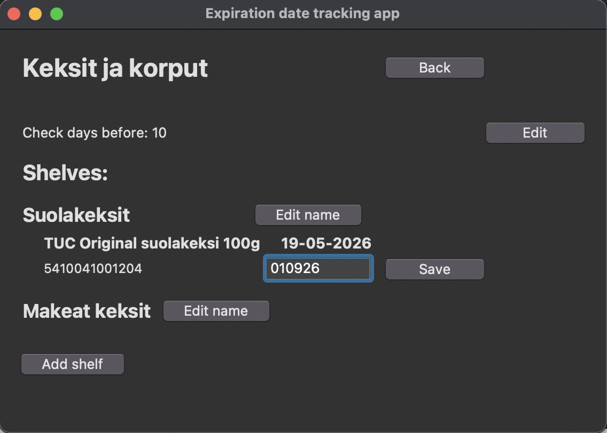

### Osaston tarkistussäännön muuttaminen

Osaston tarkistussäännön voi muuttaa osaston näkymässä. Paina _"Edit"_-painiketta oikeassa yläkulmassa _Check days before_-riviltä. Syötä uusi tarkastussääntö ja paina _"Save"_-painiketta.

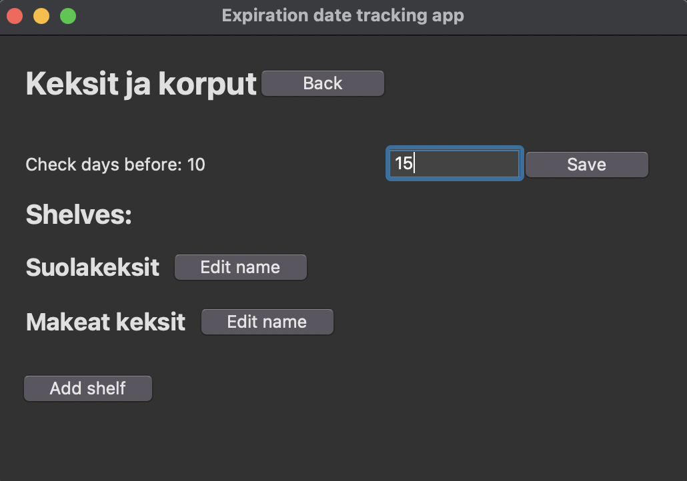

Näet uuden tarkistussäännön mukaisen listan siirtymällä osaston näkymään

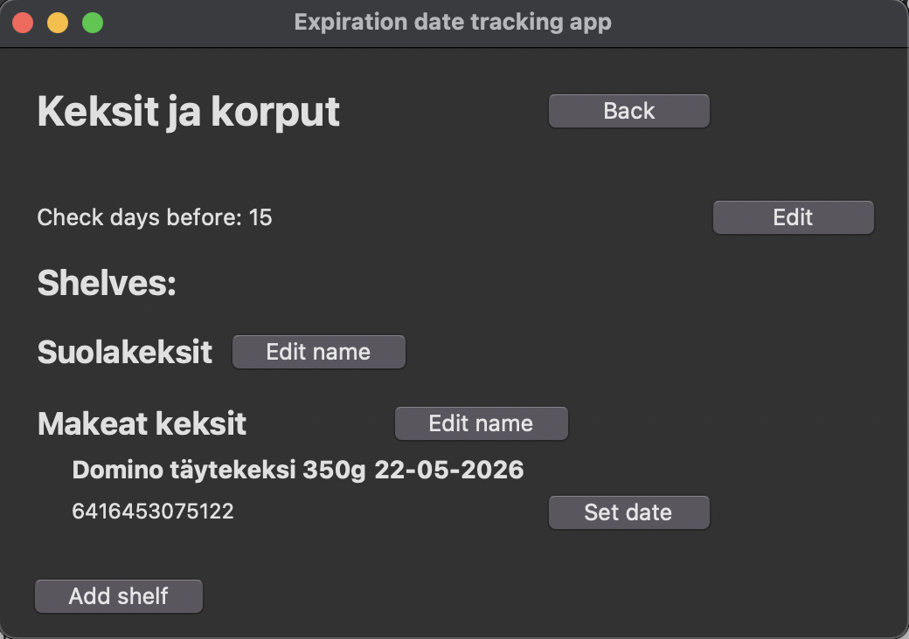