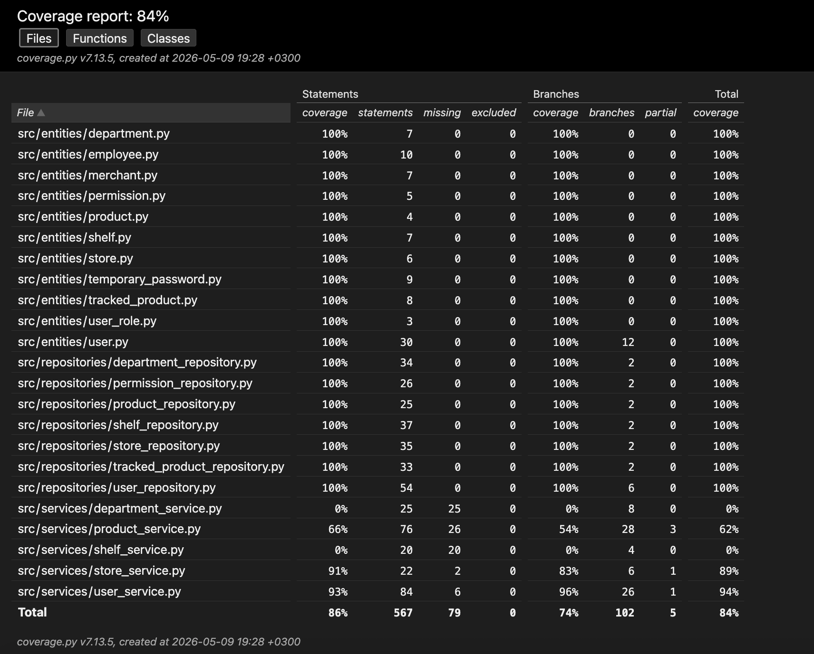

# Testausdokumentti

## Testauksen kuvaus

Sovellusta on testattu automatisoiduin yksikkö- ja integraatiotestein `entity`-, `repository`- ja `service`-luokille.

Autoatisoiduin testein on varmistettu yksikkötesteillä, että oliot toimivat oikein ja service-luokkien sovelluslogiikan toimintaa, sekä integraatiotesteillä, että tietokantaan tallennus toimii. 

Repository-testit käyttävät `test-database.sqlite`-tiedostoa, jonka nimen voi konfiguroida _.env.test_-tiedostoon.

Service-testit on toteutettu käyttämällä `MockRepository`-luokkia, jolloin service-logiikka voidaan testata ilman pysyväistallennusta oikeaan tietokantaan.


## Entity-testit

Seuraaville entity-luokille on toteutettu testit:

- Department
- Employee
- TemporaryPassword
- User

Testeissä tarkistetaan:

- olioit on luotu oikein
- getteri- ja setteri-metodien toimintaa
- validointi ja virheilmoitusten oikeellisuus

| Entity | Testattavat asiat |
|---|---|
| Department | Luonti ja attribuuttien tallennus |
| Employee | Luonti ja password_is_temporary-arvon muuttaminen Falseksi |
| TemporaryPassword | Kertakäyttösalasanan luonti |
| User | Kauppias- ja työntekijäroolien luonti ja salasanan varmennus |

Yksikkötestein testaamatta jäivät vielä luokat: `Merchant`, `Permission`, `Product`, `Shelf`, `Store`ja `TrackedProduct`, mutta näiden toimintaa on kuitenkin testattu osittain integraatiotestein repository-luokkien testauksen yhteydessä.


## Repository-testit

Repository-testit testaavat tietokantaoperaatioita SQLite-testitietokantaa käyttäen.

Testatut repositoryt:

- DepartmentRepository
- PermissionRepository
- ProductRepository
- ShelfRepository
- StoreRepository
- TrackedProductRepository
- UserRepository

Testeissä tarkistetaan:

- tallennus tietokantaan
- tiedon haku tietokannasta
- päivitys tietokantaan
- poisto tietokannasta
- foreign key -relaatiot«

Tietokannan relaatiot aiheuttavat riippuvuuksia repositoryjen välille:

```text
User <- Store <- Department <- Shelf <- TrackedProduct
```

Tämän vuoksi testidataa on täytynyt luoda oikeassa järjestyksessä ennen riippuvaisten tietojen tallennusta testitietokantaan.


## Service-testit

Service-luokkien testauksessa käytetään `MockRepository`-luokkia.

Testatut servicet:

- ProductService
- StoreService
- UserService

Testeissä tarkistetaan:

- sovelluslogiikkaa
- metodien palauttamat arvot
- virhetilanteiden käsittely

| Service | Testattavat asiat |
|---|---|
| ProductService | Tuotteiden ja seurannassa olevien tuotteiden tallennus, parasta ennen -päiväyksen päivitys |
| StoreService | Kauppojen tallennus ja kauppiaan kauppojen haku |
| UserService | Käyttäjien luonti, salasanan varmennus, sekä sisään- ja uloskirjautumislogiikka |

Testaamatta jäivät vielä luokat: `DepartmentService`ja `ShelfService`. Lisäksi mahdollisten virheellisten syötteiden käsittelyä voisi testata vielä kattavammin.


## Järjestelmätestit

Järjestemätestausta on tehty manuaaliesti, sekä macOS-ympäriössä ja Linux-ympäristössä virtuaalityöasemalla. Muun muassa build-invoke toiminta ja riippuvuuksien asennus on testattu molemmissa ympäristöissä.

Vaatimusmäärittelydokumentin toiminnallisuudet on testattu manuaalisesti molemmissa ympäristöissä.


## Testikattavuus

Käyttöliittymä, _index.py_ ja konfiguraatiotiedostot on jätetty testikattavuusraportin ulkopuolelle. Sovelluksen automaattisten testien testikattavuus on 84%

