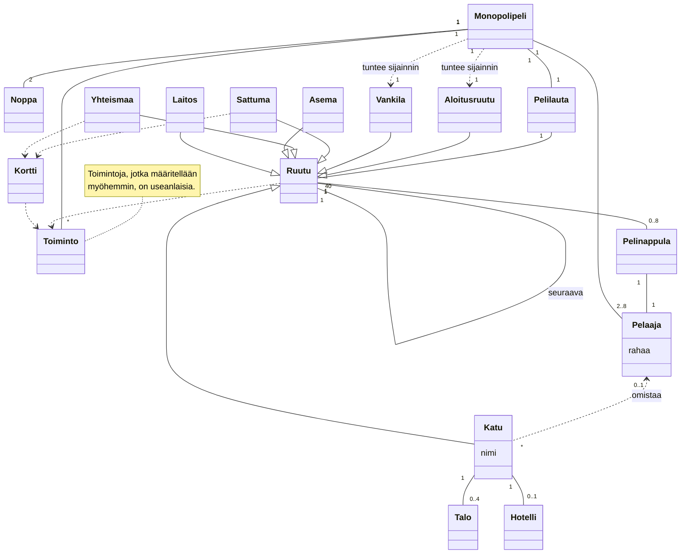

```mermaid
classDiagram
    Monopolipeli "1" -- "2" Noppa
    Monopolipeli "1" -- "1" Pelilauta
    Monopolipeli "1" -- "*" Toiminto
    Pelilauta "1" -- "40" Ruutu
    Ruutu "1" -- "1" Ruutu : seuraava
    Ruutu "1" -- "0..8" Pelinappula
    Pelinappula "1" -- "1" Pelaaja
    Pelaaja "2..8" -- "1" Monopolipeli
    Aloitusruutu --|>  Ruutu
    Vankila --|> Ruutu
    Sattuma --|> Ruutu
    Yhteismaa --|> Ruutu
    Asema --|> Ruutu
    Laitos --|> Ruutu
    Katu --|> Ruutu
    Ruutu ..> Toiminto
    Sattuma ..> Kortti
    Yhteismaa ..> Kortti
    Kortti ..> Toiminto
    note for Toiminto "Toimintoja, jotka määritellään<br>myöhemmin, on useanlaisia."
    class Katu{
        nimi
    }
    Monopolipeli "1"  ..>  "1" Aloitusruutu : tuntee sijainnin
    Monopolipeli "1"  ..>  "1" Vankila : tuntee sijainnin
    Katu "1" -- "0..4" Talo
    Katu "1" -- "0..1" Hotelli
    Pelaaja "0..1" <.. "*" Katu : omistaa
    class Pelaaja{
        rahaa
    }
```